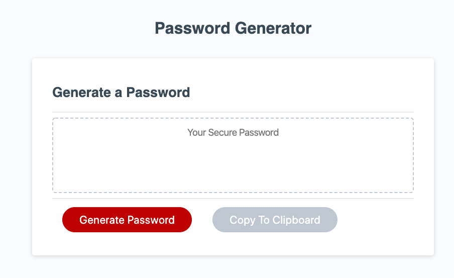

# Random Password Generator 

## A simple password generator that prompts the length and character type from the user. Once a random password is generated , it allows the user to copy the password into the clipboard. [Click to view the Random Password Generator](https://rimaodolski.github.io/Random-Password-Generator/ "Random Password Generator").
### In this project, the languages used are:
* Javascript
* HTML
* CSS
* Bootstrap 

